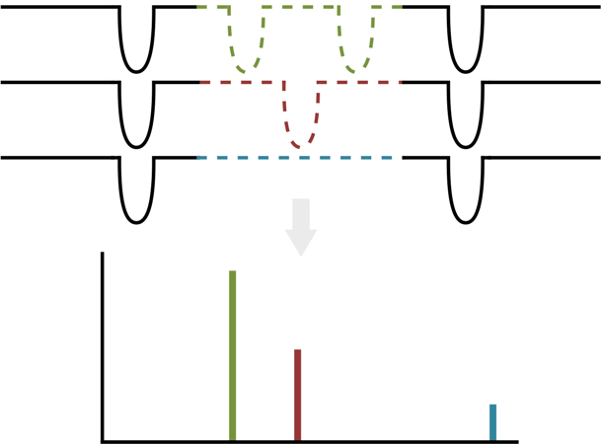

In this project, my collaborators and I laid out a foundation to find long-period planets with the K2 and TESS space missions. The [paper](https://iopscience.iop.org/article/10.3847/1538-3881/ab594c), accepted to the Astronomical Journal, outlines the new method and its use on six planet candidate systems, including a 4-planet system. 

 ____

In 2018, I watched the TESS spacecraft launch from Cape Canaveral on the big screen in Campbell Hall in Berkeley knowing I would soon have the opportunity to use its data to find and study exoplanets. TESS had a mission goal of finding earth-like planets around the habitable zones of cooler stars. As a result, it was designed to observe large regions of the sky for 27 days at a stretch before moving on, finding planets with an orbital period of 10 days at maximum. Such planets, orbiting their host stars much closer than the orbit of Mercury to the Sun, would nevertheless be in the habitable zone of a cool star. 

But what about planets with longer orbital periods, more similar to the 365 days of the Earth? The Kepler Space Telescope looked for such planets before the failure of its reaction wheels in 2012, which cut short its 5-year stare on one location of the sky. The rejuvanated K2 mission used a similar strategy to the TESS mission, staring at one location for about 85 days before moving on. 

However, there was one way to detect longer period planets--by utilizing the few locations where K2 re-observed a location after a year or two. We realized these observations, namely in Campaigns 5, 16 and 18 in K2, could be used to look for long period planets with transits in each baseline. This also would make these campaigns a perfect dress rehearsal for finding long-period planets with TESS.

The challenge with finding these long-period planets is that we only see one transit in each observation, and we may have missed any number of transits in between. This means we only know the longest possible period, but the true period could be any integer division of the longest period--a problem reminiscent of aliasing in signal processing. While it's not possible to find the true period with just the K2 or TESS observations, we *can* place constraints on the period and help to pin down the true period with ground-based observations. 

It became apparent to us that when we see these "duotransits," not ever period is equally likely. For instance, given two observations of a set duration spanned by a long gap, a shorter period planet would be more likely to transit in each observation, and a longer period planet more easily missed. This means if we see one of these duotransits, even without looking at the data, we can say it is more likely to have a shorter period.

In addition, we can also use the transit shape to help us pin down the period. Longer period planets will have longer duration transits. This, unfortunately, is somewhat degenerate with the impact parameter and eccentricity, which also influence the duration of the transit. Nevertheless, we can still use the transit shape to make good constraints on the period. 

But how do we take into account all this information quantitatively? Our main idea was to set up a Bayesian framework to fit these duo transit observations. This means we need a **prior** that weighs the periods by how likely they are to cause the observed duotransit. Then, we can perform a fit that takes into account the **evidence**, which in this case is the shape of the transit, and arrive at a **posterior**, which is the distribution showing how likely each period alias is to be the true period of the planet. 

We came up with the first *general* period prior that applies to any number of transits seen (or not seen) in any number of baselines. This is exciting because it will be applicable in cases where we see perhaps one transit in one campaign/sector and then no transit in the other--or in the case of our K2 observations, three sets of observations in which there may or may not be transits. 

Using the list of single-transits found in Campaign 5 of K2 by citizen scientists, we looked through Campaigns 16 and 18 to search for further transits. We ended up finding 6 planet systems where we also see transits in either Campaign 16 or 18 or both. 

Applying our method to these systems, we can construct a distribution of possible periods for each planet. That result is shown below, including a 4-planet system for which we characterized the system's architecture for the first time and found period distributions for each planet. 

The great thing about these new candidates is that they are both bright and long-period, filling in a niche left empty by the Kepler mission, which mainly studied faint stars that are hard to follow up from the ground, and K2 and TESS, which are designed to primarily find short period exoplanets. This can be seen in the plot below showing our new candidates against all currently discovered planet candidates:

It is my hope that this method will be useful in a few years when TESS finishes its initial pointings and starts re-observing locations on the sky. Perhaps this method could even assist in finding small planets near the habitable zones of Sun-like stars!
