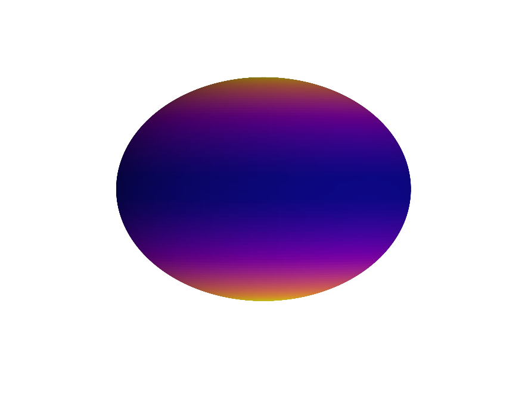
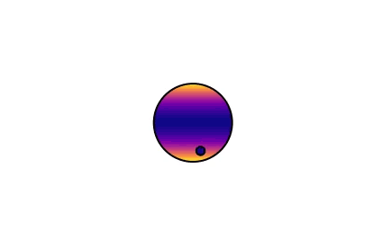

This is an ongoing project with a paper in prep and the code being developed on Github [here](https://github.com/shashankdholakia/gravity-dark).

### Transits of rapidly rotating stars

Since its first use in 2000, the transit method allows for an incredibly detailed characterization of planets orbiting around stars. By fitting the dip in brightness to a transit model, the planet's period, radius, and a host of other properties can be measured. However, one interesting parameter usually remains unknown--the orbital inclination of the planet relative to the star's rotation axis--the so-called "spin-orbit inclination". If a star is rotationally symmetric the transit will look identical no matter what the spin-orbit inclination. Most transit models today assume the star to be a rotationally symmetric sphere. 

However, many hot stars are *not* rotationally symmetric. Due to their rapid rotation, they are actually flattened out into an oblate shape. In addition, the poles of these stars are more dense than the equator, which makes them hotter and brighter. This causes a phenomenon called gravity darkening in these stars, where the equator is a dark band with the two poles as bright spots.

While these phenomena are interesting to study on their own, they also break the rotational symmetry of these stars, making the transit look different for different spin-orbit inclinations. In other words, we can use these stars' rotational effects as a protractor to measure the spin-orbit angle. In order to do this, we need a way to model the transit, taking into account both oblateness and gravity darkening.  

The orbits of all 8 planets in our Solar System are nearly fully aligned with the Sun's rotation axis--but recent observations have shown this is not the case for many planets. It would be very interesting to measure the spin-orbit inclination for a wide range of systems to understand why some are aligned while others are misaligned.

### What I did: fast, gravity-darkened & oblate transit models in starry

I decided to extend the code package starry [Luger et al. 2019](https://ui.adsabs.harvard.edu/abs/2019AJ....157...64L/abstract) to take into account both effects in rapidly rotating stars--gravity darkening and oblateness. The goal was to make a transit model for these systems than can be used to fit data with techniques such as Bayesian MCMC (or other forms of posterior inference). Currently, the method of transit-based spin-orbit measurement relies on fitting transits with visible asymmetries with transit models that are very computationally expensive to generate. If I could speed up the model by several orders of magnitude, it would allow constraints to be made on a broad sample of transits of rapidly rotating stars, with or without asymmetry. 

The code package starry was ideally suited for creating a fast transit model. Firstly, modeling gravity darkening in starry is very easy and very fast. Modeling oblateness is significantly more challenging mathematically, but after several months of effort, we finally found a way that is significantly faster than existing implementations. 

### Gravity darkening

### Oblateness

### Why are hot stars so interesting?

After my [first foray into exoplanets orbiting around hot stars](https://shashankdholakia.github.io//portfolio/m35), initially came away thinking that hot stars with close-in planets were a rare and niche set of systems. I found them interesting primarily because they were an exciting look at the extremes of planet formation. However, I found myself being pulled into researching hot stars with planets from multiple different angles. 

After taking a stellar astrophysics course, I learned that hot stars are extremely exciting stars to study. A-type stars are at the perfect temperature where radiation transports heat throughout the entire star and they have little, if any, convection. The lack of charged plasma roiling around these stars has a major consequence--they lack a magnetic dynamo to produce a strong magnetic field. Magnetism is a scary term to many astrophysicists--magnetic fields are hard to observe and can do very [strange things in planetary systems and stars alike](https://ui.adsabs.harvard.edu/abs/2010ApJ...718L.145W/abstract). Having the opportunity to study stars and planets absent any magnetic effects is very important to understand what role magnetic fields play in systems that do have them. 

The lack of magnetic fields has another exciting consequence. After accumulating gas from its parent nebula and collapsing into a dense object undergoing fusion, stars are born spinning fast. All else remaining the same, stars would continue to rotate extremely quickly for the rest of their lives. However, most stars with magnetic fields run into magnetic friction from the surrounding nebula and slow down over time. Hot stars, specifically those of spectral type A-F, can rotate at close to their breakup velocity for much of their lives. 

