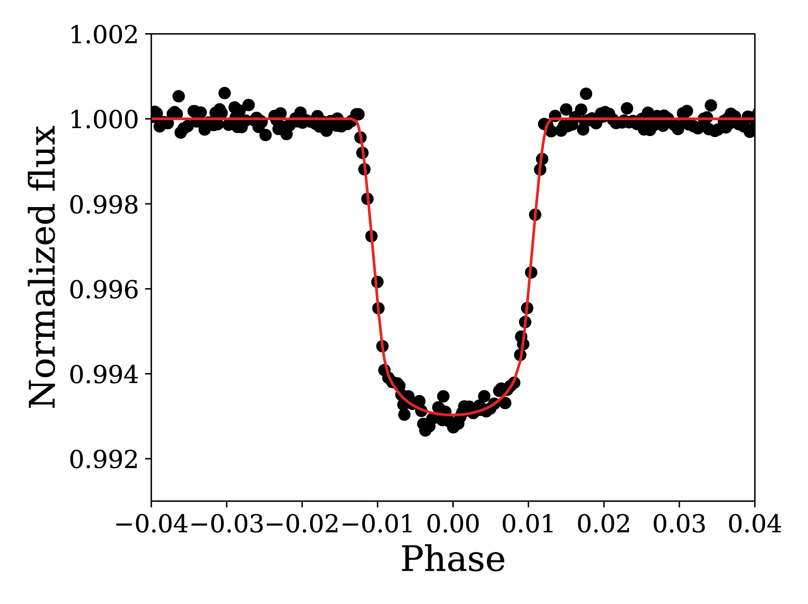
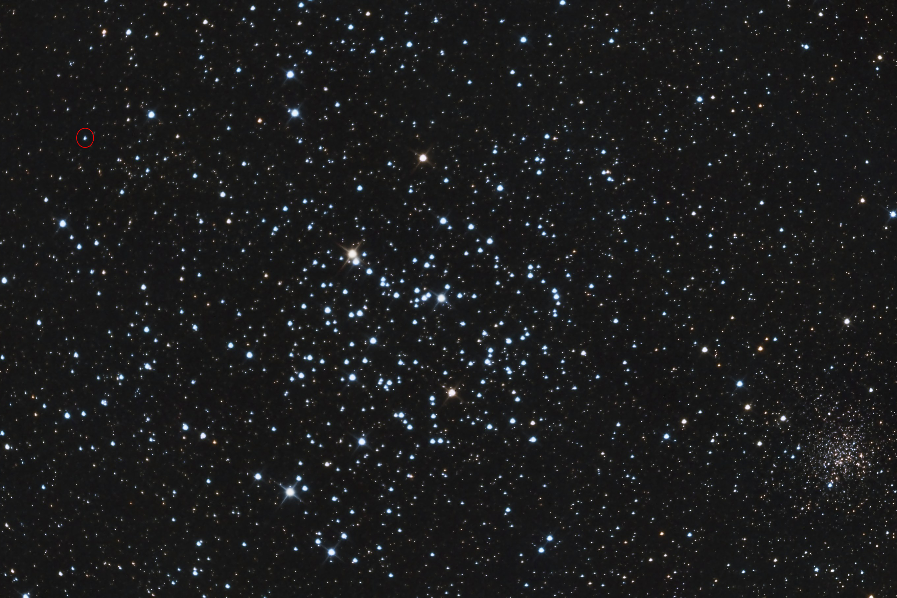

My first major foray into research, we found and characterized a planet orbiting a hot, A-type star (2MASS J06101557+2436535) from the earliest data release of the K2 mission. Read our first-author paper on this work [here](https://iopscience.iop.org/article/10.1088/1538-3873/ab324e).

### Science fair topic to discovery

This project started as a 10th grade science fair topic on searching for exoplanets in open clusters using the then-nascent K2 Mission. In the engineering test of the K2 Mission itself, two open star cluster, Messier 35 and Koposov 62, were observed for about 35 days. 

Realizing it would be difficult to manually search every star in these data for exoplanet transits, my brother and I decided to write a code in python/pyraf to search for planet transits. While much more sophisticated algorithms were being developed for this purpose, our algorithm was one of the few at the time that was designed to search in the crowded cluster region. In one of the M35 "postage stamps," we found a star with the telltale signs of a planet--periodic dips in brightness with a periodicity of 7.6 days. From our entire search, we found three more candidates in the cluster regions with dips in brightness, but the first one was by far the most promising. We submitted our work to the science fair and were quite successful, winning prizes first at the county level, then at the [California State Science Fair](https://www.prnewswire.com/news-releases/2015-california-state-science-fair-winners-announced-300087970.html), and finally the [Intel International Science and Engineering Fair](https://www.societyforscience.org/press-release/intel-isef-2015-grand-award-winners/). 

Phase-folded light curve of the new object showing the transit in the K2 data.

### Challenges: Rapid rotation and cluster membership

However, a planet isn't a planet until it is published in a peer reviewed research paper. After the science fair, we caught the attention of some members from the K2 Mission itself! We were offered a chance to present our work to them in person at NASA AMES and subsequently were able to obtain their guidance. Under Dr. Ann Marie Cody and others, we decided on observations that we would need to confirm and follow up these planets so we could publish them officially. 

We obtained spectroscopic observations from the HIRES instrument on the 10-meter Keck telescopes which revealed that the star was a hot, A-type star that was rotating rapidly. Confirming a planet using the radial velocity method relies on finding narrow absorption lines in the stellar spectrum. When a star rotates rapidly, one side of the star is blueshifted and the other side redshifted, smearing the absorption lines out and precluding precise measurements of the star's radial velocity. This would make confirmation of the planet far more difficult. Instead of attempting a ground-based confirmation, we instead decided to statistically validate the planet by ruling out all other possibilities that could explain the observed transits. 

The statistical validation confirmed that the system was a star with a bound, low-mass companion. However, lacking radial velocity measurements, we couldn't confirm that the system was indeed planetary mass. We instead used constraints on luminosity and phase-curve variations to ascertain that the companion was not a star--either an exoplanet or a brown dwarf. 

The other natural question that arose was whether the system was truly a part of the Messier 35 cluster or whether it was in the background or foreground. We attempted to collect all available data to ascertain cluster membership. At the time of this work circa 2016, ascertaining cluster membership was not a trivial task. Using a combination of the Keck spectrum, color photometry, and proper motions from the UCAC4 catalog, we found that the data were consistent with the system's membership in Messier 35. 

We submitted our work to a journal and were recommended to wait a few months for the Gaia spacecraft to release a vast and precise catalog of data--which would settle the question of membership once and for all. On the release of Gaia DR2, we found that it was actually in the near background of M35--too close for our previous methods to distinguish, but nevertheless a likely background object. 

These challenges, both in confirming the planet and its membership in the cluster, dragged out the publication and tested my resolve at many points. Finally after over 3 years of effort on the paper we finally rewarded with acceptance to a publication!

### Why is the planet interesting (to me)?

 Our own image of Messier 35 showing the star hosting the planet we found circled in red. Image taken with a 111mm refractor and a CCD camera. 

Well first of all, as can be seen from the image above, it's in a beautiful region of the sky! As an amateur astronomer, I've seen Messier 35 countless times through my own telescope. And at this point, I know the exact position of 2MASS J06101557+2436535 within the cluster region like the back of my hand.

Secondly, the transit of this object is deep enough that it's not entirely out of reach of a small telescope. This means that it's long been a goal of mine (so far unsuccessful) to observe a transit of 2MASS J06101557+2436535b with my own backyard telescope. 

Of course, my bias is showing. However, from a scientific point of view the system is no less exciting, Hot stars tend to be rapidly rotating and this star is no exception--in fact it has **the highest rotational velocity of any exoplanet host known to date**. The rapid rotation, while presenting challenges to confirmation of the planet via radial velocity, also lends itself to a range of very interesting measurements. For instance, Doppler tomography can reveal the planet's spin orbit inclination, yielding a wealth of information about the history of this system, In addition, my more recent work on taking into account [gravity darkening and oblateness](/portfolio/gdark) will be very applicable to this system. 

The rotation rate of this star is no coincidence--this star falls right around the mean rotational velocity of stars of this temperature and size. Because finding and confirming planets is hard around stars like these, planets found to date around hot stars have systematically lower rotation rates. The TESS mission should add a wealth of new systems that are like this. 

